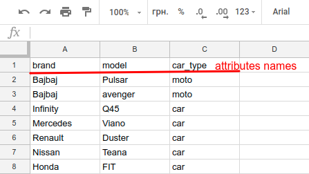

# Seed examples

Seeding is a process when you automatically fill in a database with data.
What's the business idea of this? Imagine that you have a lot of databases, and you have to fill each of them with your common initial data.
It takes too much time resources to do it manually. Create Initial dump is not a good idea, because it is not agile.
Seeding is a very helpful tool in this case.

## File structure

Using [SeedBank](https://github.com/james2m/seedbank) we can separate logic for production and development environments.

```bash
db/
  └── seeds/
    ├── development/
    |   └── *.seeds.rb
    ├── production/
    |   └── *.seeds.rb
    ├── seeds.rb
    └── modules/
```

Now you can run seeds in the scope of your environment; it's also a good idea to move common logic to modules and to include them to seeds files.

## Development environment

Commonly for populating development DB we use [Faker gem](https://github.com/stympy/faker) because
in this case, we may ignore the data integrity.

```ruby
  10.times do
    User.create(name: Faker::FunnyName.two_word_name, email: Faker::Internet.email, password: 'password')
  end

  10.times do
    category = Category.create(name: Faker::Coffee.variety)
    5.times do
      category.tags << Tag.create(name: Faker::Cat.name)
    end
  end

  100.times do
    Post.create!(title: Faker::Lorem.sentence, body: Faker::Lorem.paragraph)
  end
```

## Production environment

For production mode you need real data, we store them in CSV files on Google Docs and follow common structure for them



In a Header, we write attributes names, and each row is an object with attribute values. In this case, it is really easy to add, remove or change data.

```ruby
    def categories
      file = 'path_to_categories_csv'
      Category.create(extracted_params(file))
    end

    def brands
      file = 'path_to_brands_csv'
      Brand.create(extracted_params(file))
    end
```

And inside of our extracted_params method we will parse CSV and create an array with params.

```ruby
  def extracted_params(file)
    parsed_csv(file).map { |row| row.to_h }
  end

  def parsed_csv(file)
    data_csv = URI.open(file).read
    CSV.parse(data_csv, headers: true)
  end
```

Now we have DB with all the necessary data.

## Useful Gems

[SeedBank](https://github.com/james2m/seedbank) - Seedbank gives your seed data a little structure. Create seeds for each environment, share seeds between environments and specify dependencies to load your seeds in order.

[Faker gem](https://github.com/stympy/faker) - A library for generating fake data such as names, addresses, and phone numbers

[Seed Dump](https://github.com/rroblak/seed_dump) - It allows you to create seed data files from the existing data in your database

[seed-fu](https://github.com/mbleigh/seed-fu) - Advanced seed data handling for Rails, combining the best practices of several methods together

## License

rails-multi-environment-seeding is Copyright © 2015-2018 Codica. It is released under the [MIT License](https://opensource.org/licenses/MIT).

## About Codica

[](https://www.codica.com)

We love open source software! See [our other projects](https://github.com/codica2) or [hire us](https://www.codica.com/) to design, develop, and grow your product.
